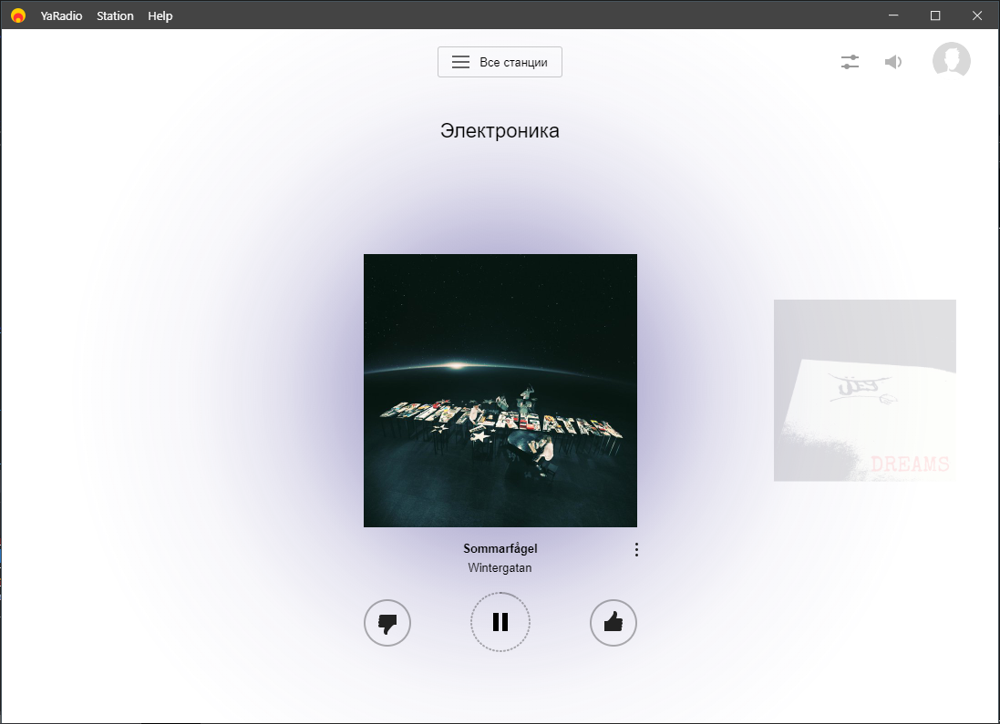
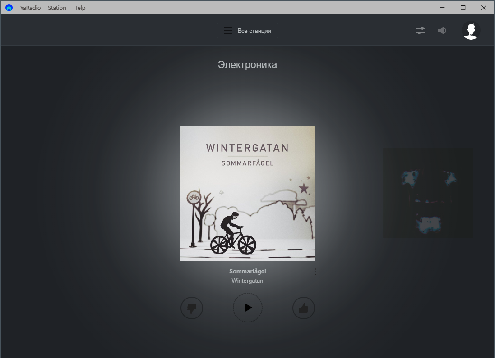

# YaRadio 

Unofficial Desktop app for [Yandex.Radio](https://radio.yandex.ru/) with keyboard shortcuts, notifications, ad blocking and themes.

At this moment this project needs a partial code rewrite (some dependencies are deprecated, they also have some non-critical vulnerabilities, version of electron is ancient).

Known problems:
- App doesn't store user session anymore.
- Ads may still appear.



### Install
*Mac OS 10.9+, Windows 7+ and Linux are supported.*

**Mac OS and Linux versions have never attempted to build. The application may look weird. Feel free to create issue/pull request.**

#### Mac OS
Build and move `YaRadio.app` to the `/Applications` directory.
#### Linux
Build and move to some location.  
To add a shortcut to the app, create a file in `~/.local/share/applications` called `YaRadio.desktop` with the following contents:
```
[Desktop Entry]
Name=YaRadio
Exec=/full/path/to/folder/YaRadio
Terminal=false
Type=Application
Icon=/full/path/to/folder/YaRadio/resources/app/static/Icon.png
```
#### Windows
Build and move to some location.

---
### Dev
Built with [Electron](http://electron.atom.io).
###### Commands
- Init: `$ npm install`
- Run: `$ npm start`
- Build macOS: `$ npm run build:macos`
- Build Linux: `$ npm run build:linux`
- Build Windows: `$ npm run build:windows` (for *macOS* wine is required `$ brew install wine`)
- Build all: `$ npm run build`
# License
MIT © [Silve](https://git.teiko.studio/SilverIce)

Special thanks to [Maxim Ponomarev](https://github.com/maxvipon/) for making first version of this app.
